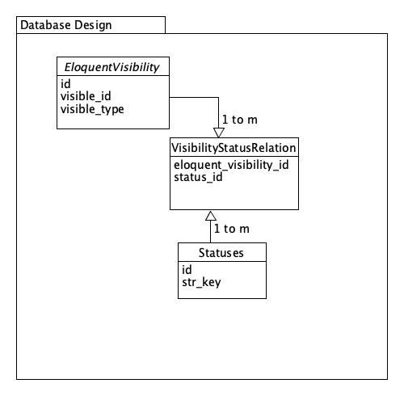

# Development Plan Guidelines

## Package description

Using String keys in controllers, repositories, middlewares or in the query itself, the code will filter certain rows from any model that has the EloquentVisibility traits.

A model can be public, meaning that each row is accessable to any one, except when a certain status string is passed along with the query.
It can also be private, meaning that no one can call any row unless a certain status string key is passed.

The status string key can be a user's role. It can be passed in a middleware.

## Database Design

## Steps to Complete the package development

TDD will be used all the way.

- Making migration files
- Implement Unit tests on these files as a base for the following unit tests.
- Write Unit Tests for models, then create those models to pass the tests.
- Write Traits tests and then write traits/Scopes to pass the tests.
- Make Configuration file along the way
- Add the ability to use Role table in laravel-permission package instead of statuses made by Spatie.
- Write Tests for that as well.

